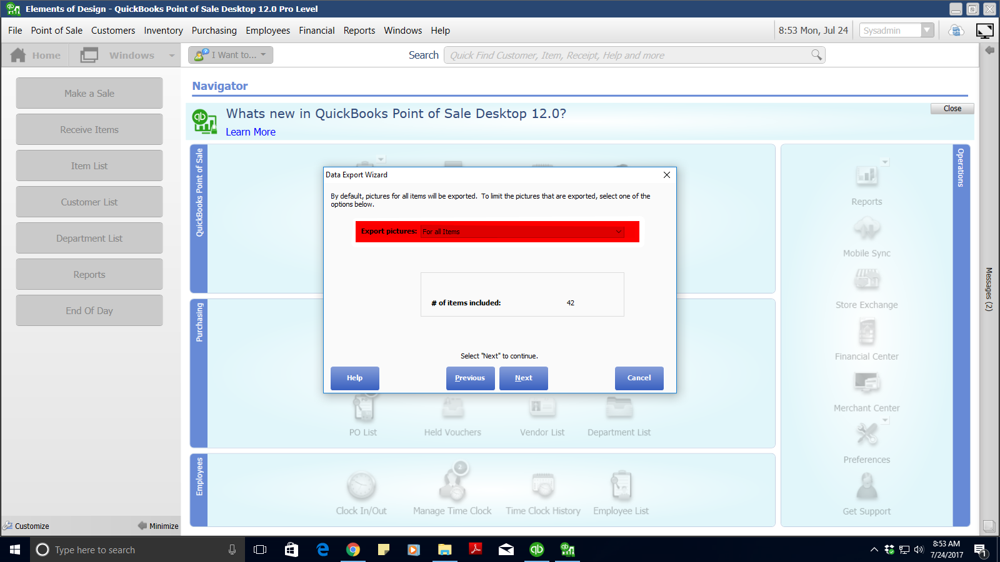

# Dowload Images from POS

#### Go To "File > Utilities > Export"
    

#### Select "Item Pictures" then "Next"
    

#### Select "For all Items" under the "Export picture dropdown" then "Next"
    

#### Specify Details
    ###### Enter "C:\Users\Google Drive\website\uploads\photos" in "Select Destination Folder"
    ###### Select "Item #" from the "Create file names using:" dropdown
    ###### Ensure only "Default view" is selected in "Export pictures for the items:"
    

#### Uncheck "Open the destination folder..." than "Export"
    
