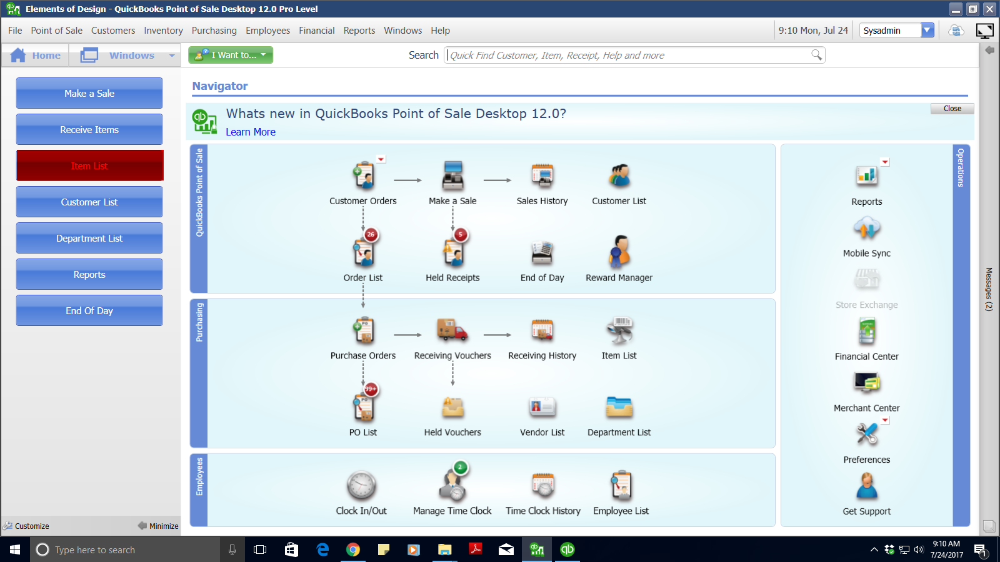
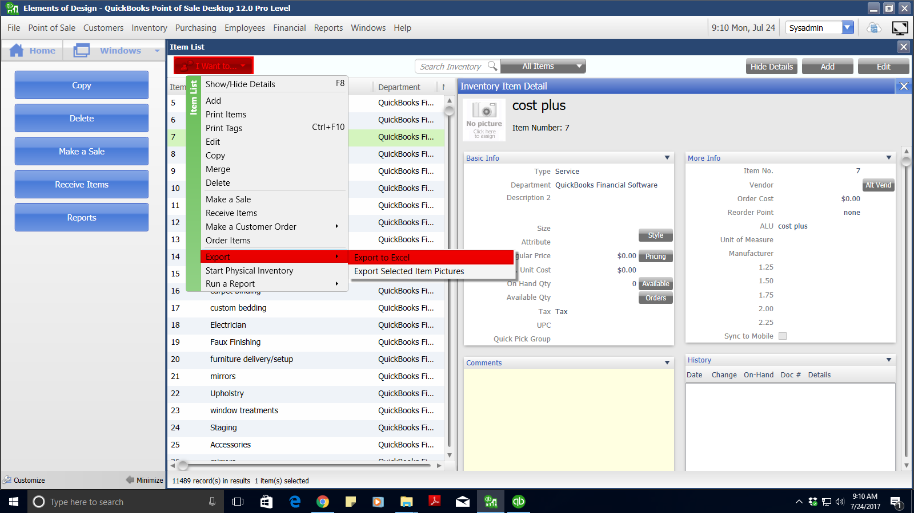
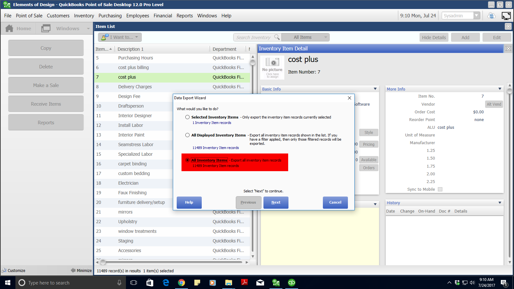
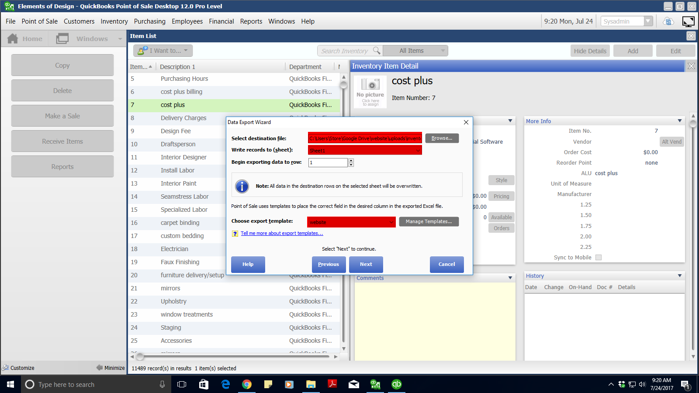
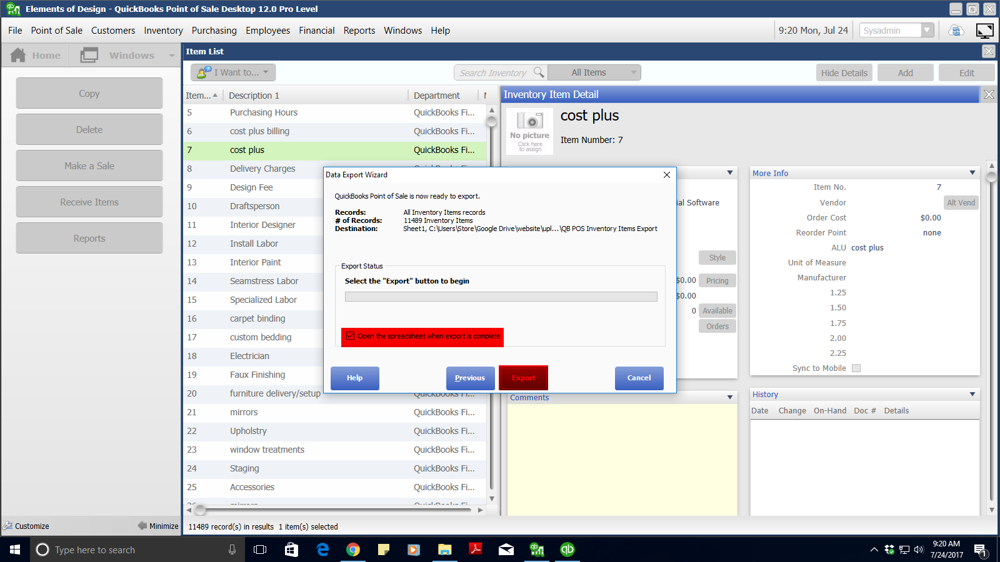

# Download Boutique Inventory File from POS

#### Select "Item List"
   

#### Select "I Want to..." > "Export" > "Export to Excel"
   

#### Select "All Inventory Items"
   

#### Specify the following
   ###### Enter "C:\Users\Google Drive\website\uploads\inventory_files/inventory_file.xls" in "Select destination file"
   ###### Select "Sheet1" from the "Write records to..." dropdown
   ###### Select "website" from the "Choose export template" dropdown
   

#### Uncheck "Open the spreadsheet..."
   
