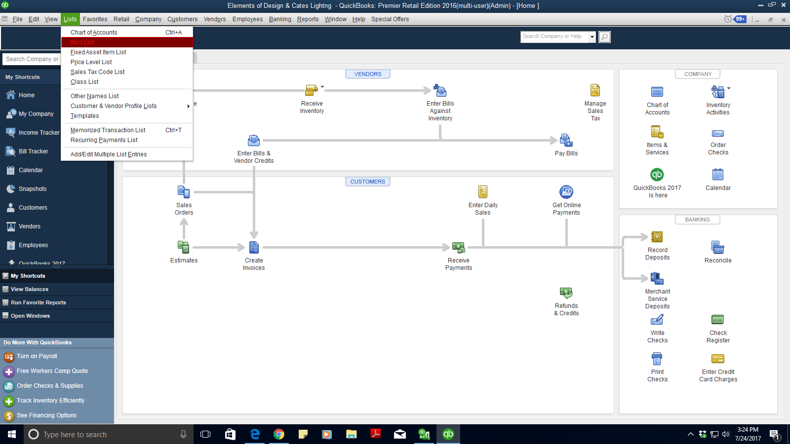
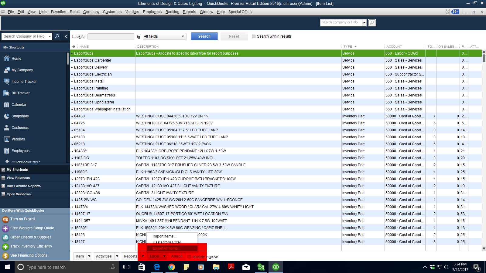
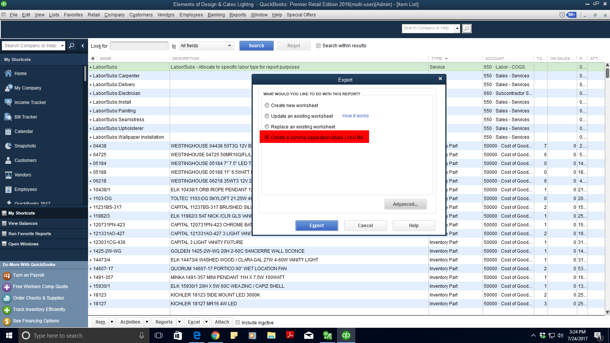
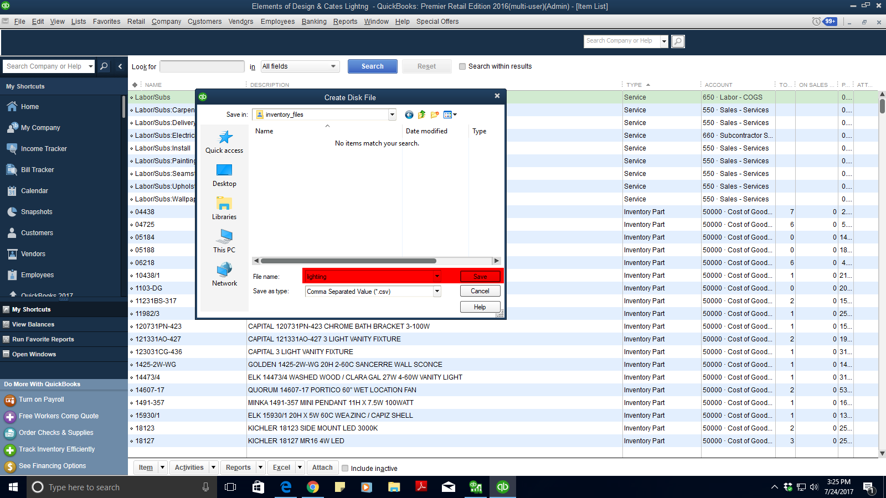

# Download Lighting Inventory File from QB

#### Select "Lists" > "Item List"
   

#### At the bottom, select the down arrrow next to "Excel"
   

#### Select "Create a comma separated values (.csv) file"
   

#### Save the inventory file
   ###### In folder: "C:\Users\Google Drive\website\uploads\inventory_files\"
   ###### As "lighting"
   
